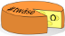

#  #twäse

Text generator that removes or replaces randomly chosen words or letters in your text.

Built to mangle tweets, but works with any text.

"Twäse" is an amalgamation of "Tweet" and the German word for cheese, "Käse", since this word punches holes into your text.

## Build
Development build: `npm run dev`.
Production build: `npm run build`

## License
[See LICENSE file](LICENSE)
